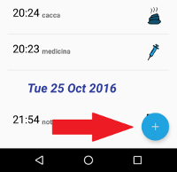
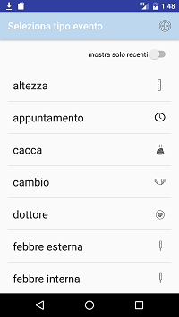
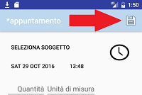

Per inserire un nuovo evento premere sul pulsante + presente in basso a destra.

Verrà richiesta la tipologia di evento da inserire

Per terminare l'inserimento dell'evento cliccare sul pulsante salva in alto a destra

