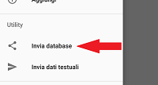

Per inviare i dati del bebemanager utilizzare l'opzione *Utility / invia database* del menu a scomparsa

Verrà mostrata la lista delel applicazioni che è possibile utilizzare per inviare il database. Tale lista dipende dalle applicazioni installate sul telefono.

Il file dei dati del bebemanager pu&ograve essere importato su un qualsiasi bebemanager semplicemente cliccandovi e selezionando l'applicazione *Importa dati in Bebe Manager*

## Attenzione !!!

I dati del bebemanager sono contenuti all'interno del telefonino. In caso di perdita o cancellazione non è più possibile recuperarli.

Si condiglia periodicamente l'invio dei dati (via mail, google drive ,...) in modo da avere una copia di riserva.

Sui dati presenti sul telefonino o inviati non è presente alcuna forma di encryption o signign
