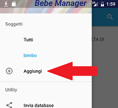
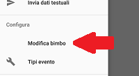

Il soggetto &egrave; l'entit&agrave; a cui si riferiscono gli eventi registrati, ad esempio un bambino; ogni soggetto &egrave; identificato da uno nome univoco e da un colore

Al primo accesso al bebe manager viene richiesto il nome del proprio bambino ed il sesso, in modo da creare un soggetto di colore rosa per le femminucce, blu per i maschietti

# Aggiunta soggetti

Per aggiungere un soggetto selezionare la voce *Soggetti/Aggiungi* dal menu a scomparsa

# Modifica e rimozione di un soggetto

Dal menu a scomparsa selezionare *Configura / Modifica {nomeSoggetto}*. Verr&agrave; presentato un form che consente la modifica e rimozione del soggetto.

I caso di modifica del nome di un soggetto il nuovo nome viene aggiornato anche tu tutti gli eventi registrati.

La rimozione di un soggetto comporta esclusivamente la rimozione dalla vista, gli eventi registrati vengono comunque mantenuti
